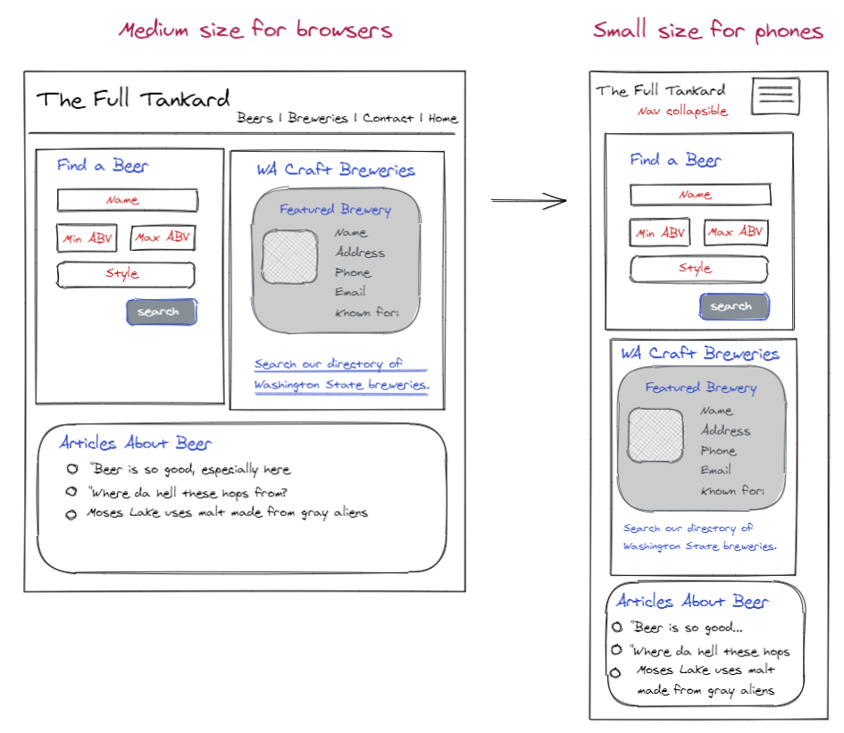
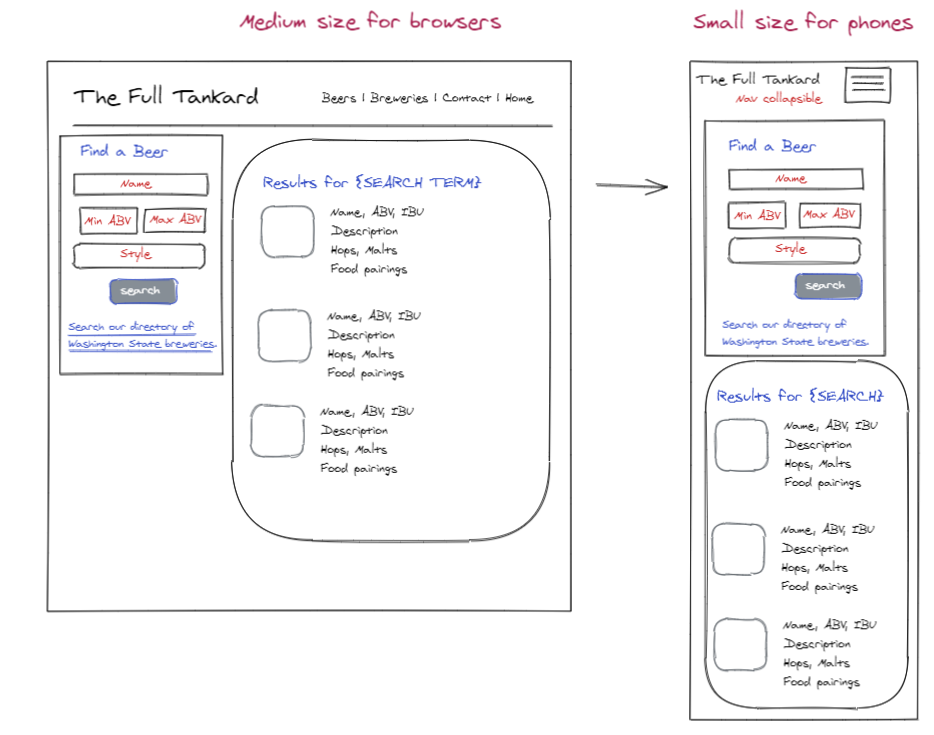

# THE FULL TANKARD

## DESCRIPTION
Introducing "The Full Tankard", an streamlined web application, allows bar managers to find information about local beers and breweries in Washington State.

---------
## USER STORY
Bar managers have to make purchasing decisions, sometimes on the fly, sometimes mapped out weeks or months in advance. As such, they need access to information about the available offerings from local breweries.   

AS A bar manager
I WANT to search for beers by name, style, ABV, or characteristics in description
SO THAT I can locate and procure local beers that my customers will enjoy or have enjoyed.

Also, AS A bar manager,
I WANT a directory of brewers by name with styles of beer brewed and contact information
SO THAT I can locate and procure local beers from brewers that my customers might enjoy at my bar.

---------
## OUR SOLUTION
* Kanban board
* The Pitch: Why our app? 
* Our MVP vs Product Vision 

### TECHNOLOGIES UTILIZED 
* Materialize for our CSS framework
* APIs: currently using
    * Open Brewery [https://www.openbrewerydb.org/documentation/01-listbreweries]
    * Beer.db [https://openbeer.github.io/]
    * Brewerydb.com [https://www.brewerydb.com/developers/docs]

* APIs for Ratings/Social media: TBD 
    * The Beer Spot [http://www.thebeerspot.com/api/reference]
    * Ratebeer.com [https://www.ratebeer.com/api-documentation.asp]

---------
## ACCEPTANCE CRITERIA
GIVEN ...
AS A ...
WHEN ...
THEN ...

---------
## VIEW THE MOCKUPS
The following images show the appearance and functionality of our MVP:

### Homepage (browser & phone)

### Results page (browser & phone)

---------
## ABOUT THE TEAM
* Rita Z. is our lead UI/UX designer.
* Elias Calagiu is our lead developer.
* Shea Mullaney is our project manager.